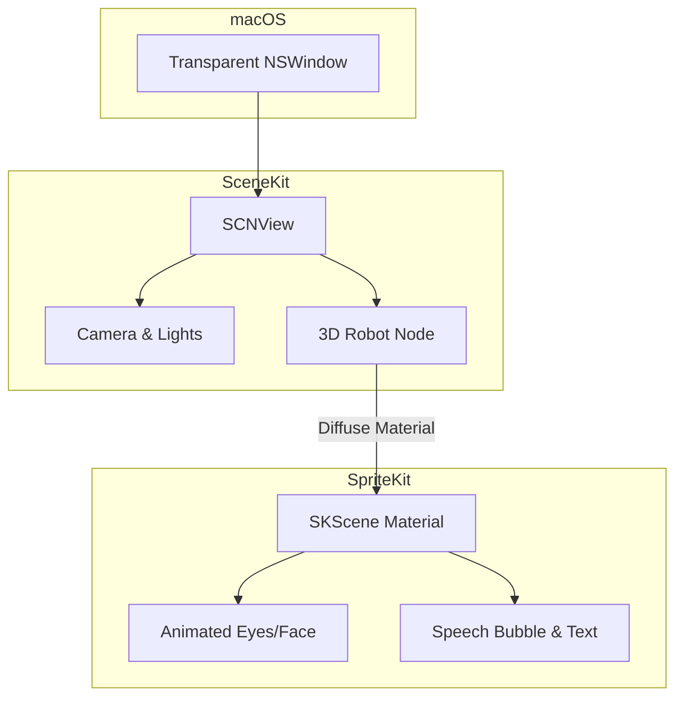
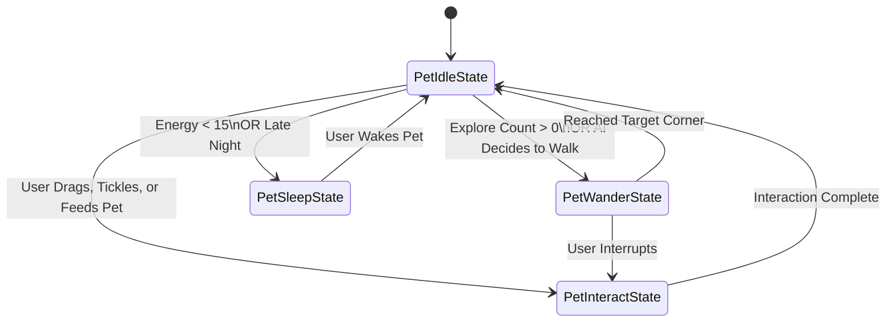
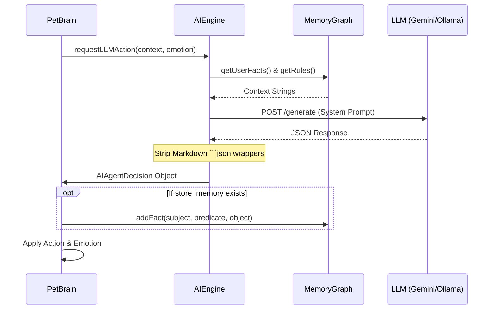

# Building Byte: An Autonomous AI Desktop Pet for macOS

Have you ever wanted a small, curious, and slightly chaotic companion living on your desktop? Meet **Byte**, an autonomous AI desktop pet built natively for macOS. 

Byte doesn't just wander around your screen; he listens to your voice, learns your preferences, knows what apps you are using, and forms his own autonomous thoughts using Large Language Models (LLMs) like Gemini and Ollama.

In this post, I'll dive deep into what Byte can do, how the project is structured, and the technical challenges of blending 3D graphics (SceneKit), 2D interfaces (SpriteKit), and AI decision-making into a single, seamless macOS application.

---

## What Can Byte Do?

Byte is designed to feel alive, reactive, and context-aware.

*   **Autonomous Exploration:** Byte freely walks around your screen, avoids active windows (in Work Mode), and takes naps when his energy is low or when it gets late at night.
*   **Context & Environment Awareness:** He watches your active applications. If you type frantically, he might start dancing to the rhythm. If your CPU gets too hot, his mood drops and he sweats. If you download a new file, he gets curious and asks you about it.
*   **Voice Interaction:** By long-pressing the `Command` key, you can talk directly to Byte using your voice. He responds using a native Text-to-Speech (TTS) engine, complete with dynamic, auto-resizing speech bubbles.
*   **Persistent Memory & Reinforcement Learning:** Byte remembers things. If you tell him your favorite color is green, he stores it in his `MemoryGraph`. If you tell him to "stop using emojis" or "talk like a pirate," he writes a persistent behavioral rule and alters his future personality to obey you.

---

## Architecture: How It All Works

Building an autonomous agent requires a robust architecture. The system is split into three core pillars: the **Visual Engine**, the **State Machine Brain**, and the **AI/Memory Engine**.

### 1. The Visual Engine (SceneKit + SpriteKit)

Byte is rendered using a borderless, transparent, floating `NSWindow` that covers the entire macOS display while passing mouse clicks through to the desktop below.

*   **SceneKit** handles the 3D rendering of Byte's body, lighting, and spatial positioning.
*   **SpriteKit** is used as a *material* mapped onto Byte's 3D face to render 2D animated eyes, facial expressions, and his dynamic speech bubble.



**Overcoming Concurrency Issues:** One of the biggest challenges was thread safety. SceneKit renders on a background thread, while SpriteKit updates often happen on the main thread. When dynamically resizing the `SKShapeNode` for his speech bubble while SceneKit was drawing it, we ran into `EXC_BAD_ACCESS` memory crashes. The solution? **Node Swapping.** Instead of mutating the path of an active shape, we construct a completely new bubble off-screen and swap it into the tree, allowing SpriteKit's internal locks to handle the thread safety seamlessly.

---

### 2. The Brain (GameplayKit State Machine)

To prevent Byte from executing conflicting animations (like trying to sleep and jump at the same time), his core logic is driven by Apple's `GameplayKit` via a `GKStateMachine`.



In the **Idle State**, a timer ticks down. When the timer hits zero, Byte queries the AI Engine to decide what to do next. The `PetBrain` also tracks physical stats: `Energy`, `Mood`, `Curiosity`, and `Annoyance`, which organically bias his emotional state over time.

---

### 3. The AI & Memory Engine

When Byte needs to make a decision, he doesn't use simple random numbers. He builds a comprehensive context prompt and sends it to either **Gemini 2.5 Flash** (Cloud) or **Ollama** (Local llama3.2).

The prompt includes:
1.  **Environment Context:** Active windows, CPU state, time of day.
2.  **Current Stats:** Current emotion and available actions.
3.  **Memory & Rules:** Retrieved facts about the user and strict behavioral rules.

The LLM is instructed to return a strictly formatted JSON response determining his next move:

```json
{
    "action": "wander",
    "emotion": "curious",
    "speech": "I wonder what you are coding right now?",
    "store_memory": {
        "subject": "User",
        "predicate": "is using",
        "object": "Xcode"
    }
}
```



**JSON Parsing Resiliency:** LLMs are notorious for wrapping JSON responses in markdown code blocks (````json ... ````). We implemented a strict sanitization pipeline that strips these wrappers before decoding, ensuring the engine never crashes from a malformed string.

---

### 4. Voice Integration & Interruptions

Allowing you to talk to Byte natively involved two native frameworks: `AVAudioEngine` for dictation and `AVSpeechSynthesizer` for his responses.

*   **Dictation:** When you hold `Command`, `VoiceInputManager` spins up an `SFSpeechRecognizer` audio tap.
*   **Race Conditions:** If Byte was in the middle of talking and you interrupted him, the background TTS engine would keep firing `didStart` events, constantly overwriting the UI's "Listening..." state with his old speech. We solved this by wiring the dictation trigger to instantly call `synthesizer.stopSpeaking(at: .immediate)` and aggressively flush the text queue.

---

## Conclusion

Building Byte was a fascinating journey into mixing traditional game development patterns (State Machines, Vector paths) with modern Agentic AI (LLMs, JSON-based decision making, Reinforcement Learning). 

By utilizing native macOS tools like `SCNView` and `AVSpeechSynthesizer`, Byte is incredibly lightweight, able to run completely locally via Ollama, and serves as a genuinely fun, interactive companion that makes the desktop feel just a little less lonely.
