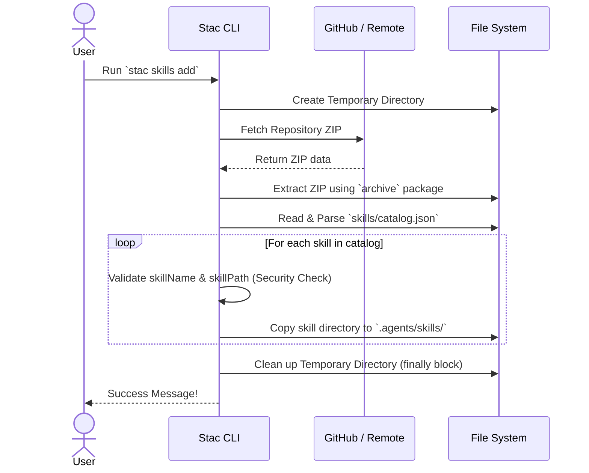
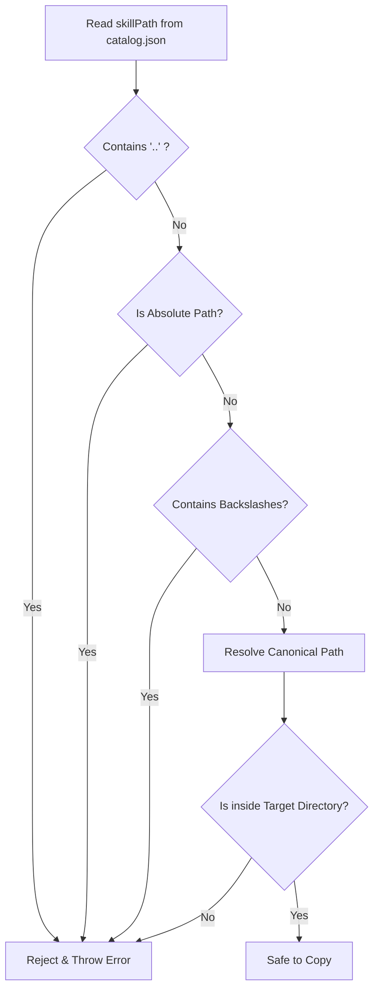

# Building a Native Dart Skills Installer for Stac: A Technical Deep Dive

When building tools for the Dart and Flutter ecosystem, one of the primary goals is to keep the developer experience as seamless and native as possible. 

Recently, we introduced a major improvement to the Stac CLI: **a Dart-native installation path for Stac skills**. Previously, users had to rely on Node.js and `npm`/`npx` to install agent skills. While functional, requiring a completely different language runtime just to install a skill felt out of place for a Dart tool. 

In this post, I'll walk you through how we designed and implemented the `stac skills add` command, the architectural decisions behind it, and the crucial security measures we put in place.

---

## The Goal: No More `npx`

The objective was simple: allow users to install Stac agent skills directly through our CLI without needing any external dependencies. 

Instead of running an `npx` command, developers can now simply run:
```bash
stac skills add
```
Furthermore, we integrated this directly into the `stac init` workflow, so new users are prompted to optionally install agent skills right when they create a new project!

---

## How It Works Under the Hood

To make this work natively, the CLI needs to act as a package fetcher and installer. Here is a high-level look at the architecture using a sequence diagram:



### 1. Fetching and Extracting the ZIP

Rather than pulling individual files or requiring `git` to be installed on the host machine, the CLI downloads the skills repository as a `.zip` archive. 

We added the `archive` package (`^4.0.9`) to handle the extraction process. The ZIP is extracted into a **temporary directory** on the user's machine. 

**Pro Tip:** Dealing with temporary files can be tricky. If the process fails halfway through, you don't want to leave junk files on the user's disk. We wrapped the entire extraction and installation logic in a `try/finally` block to ensure that the `tempDir` is *always* deleted, regardless of whether the installation succeeds, fails, or throws an exception.

### 2. Parsing the Catalog

Once extracted, the CLI looks for a `skills/catalog.json` file. This acts as the source of truth, telling the CLI which skills are available in the archive and where their respective directories are located.

---

## The Most Important Part: Security & Path Hardening

When you are downloading archives from the internet and extracting them to a local file system, **security is paramount**. The biggest risk in this scenario is a **Path Traversal Attack** (often known as a "Zip Slip" vulnerability).

If a malicious `catalog.json` or ZIP file contains paths like `../../../../etc/passwd`, a naive extraction script could overwrite critical system files.

To prevent this, we implemented strict **path containment checks and catalog entry validation**:



### Our Security Checklist:
1. **Reject `..` segments:** We explicitly check for and reject any paths trying to navigate up the directory tree.
2. **Reject Absolute Paths:** All paths must be relative to the extraction directory.
3. **Reject Backslashes:** Normalizing paths helps prevent bypasses that mix forward and backward slashes.
4. **Canonical Boundary Checks:** We resolve the final absolute path of the destination and verify that it strictly starts with the intended target directory (`.agents/skills/`). If a path manages to escape the boundary, the operation is immediately aborted.

---

## Seamless Onboarding with `stac init`

Building the `skills add` command was only half the battle. We wanted to make sure new users actually discovered this feature.

By updating the `stac init` command, we accept an optional `targetDirectory` parameter in our `AddCommand`. Now, when a user initializes a new Stac project, the CLI interactively asks them if they'd like to install the standard agent skills. If they say yes, the native Dart installer handles everything in the background, dropping the skills perfectly into their newly created project directory.

## Conclusion

By dropping the Node.js dependency and building a native Dart installation path, we've made the Stac CLI faster, more secure, and much easier to use. 

It was a fantastic exercise in working with file systems, handling network streams, and implementing robust security validations in Dart. If you're building CLI tools in Dart, always remember to clean up your temp directories and never trust paths from external sources!

*Have you built CLI tools in Dart? Let me know your thoughts on Twitter!*

> **Update:** The Pull Request for this feature ([#481](https://github.com/StacDev/stac/pull/481)) has officially been merged into the `StacDev/stac` repository! 🚀
